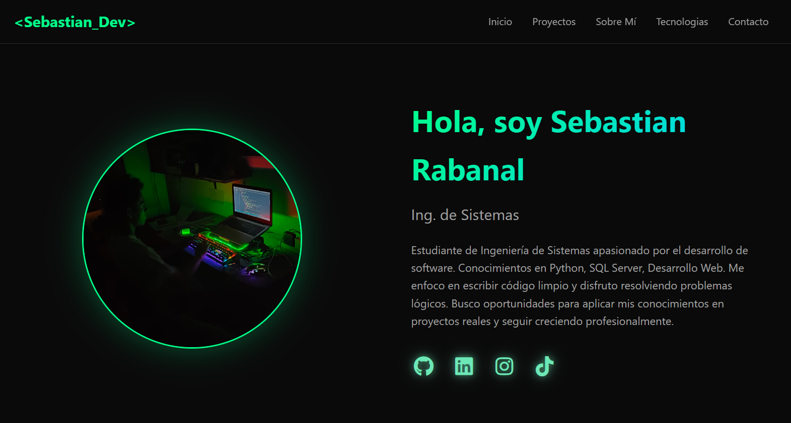
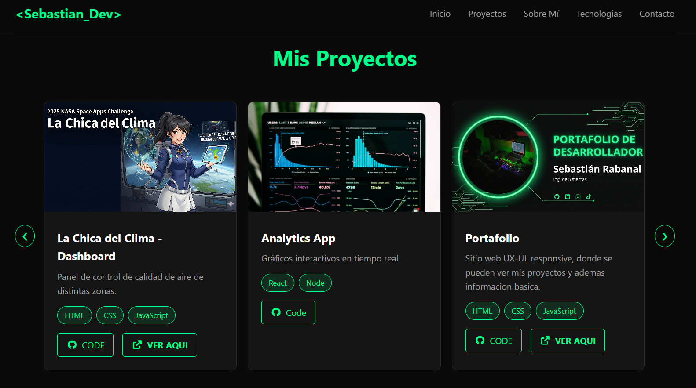
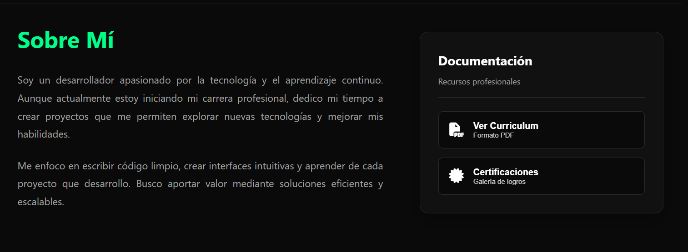
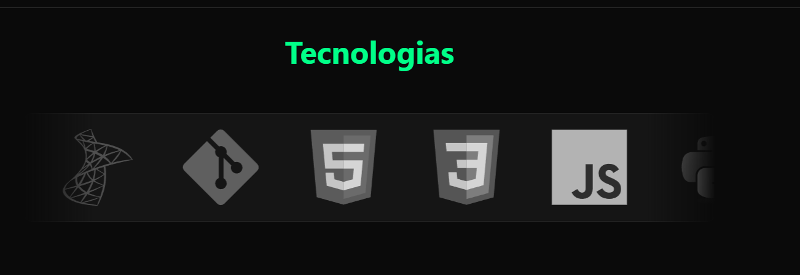
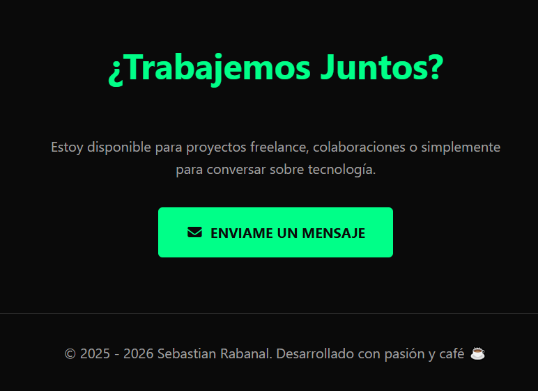

<div align="center">
  <h1 align="center">✨ Portafolio Web - Sebastian Rabanal</h1>
  <h3>Ingeniero de Sistemas | Desarrollador de Software</h3>

  <p>
    <a href="https://github.com/SebastianRabanal">
      
    </a>
    <a href="https://www.linkedin.com/in/sebastianrabanalfrancia/">
      
    </a>
    <a href="mailto:sebastianrabanal34@gmail.com">
      
    </a>
  </p>

  <p>
    
    
    
    
  </p>
</div>

---

## 🚀 Sobre el Proyecto

Este repositorio contiene el código fuente de mi **Portafolio Profesional**. Es una aplicación web moderna diseñada para mostrar mis proyectos, habilidades técnicas y certificaciones académicas.

El diseño sigue una estética **Dark Neon** (`#00ff88`) enfocada en la experiencia de usuario (UX/UI), completamente responsiva para dispositivos móviles y escritorio.

### 🌐 Demo en Vivo
Puedes ver el portafolio funcionando aquí:  
👉 https://sebastianrabanal.github.io/PORTAFOLIO-WEB

---

## ✨ Características Principales

Este no es solo un sitio estático, incluye lógica avanzada en **JavaScript Vanilla**:

* **📱 Diseño 100% Responsivo:** Adaptación fluida a móviles con menú tipo hamburguesa y ajustes de layout mediante *Media Queries*.
* **🎡 Slider de Tecnologías Infinito (Draggable):** Un carrusel continuo que permite arrastrar (drag & drop) los iconos de las tecnologías, con efecto de bucle infinito matemático.
* **🖼️ Galería de Proyectos:** Slider manual para navegar entre mis trabajos destacados.
* **📜 Sistema de Modales:**
    * **Visor de PDF:** Integración para visualizar mi CV directamente en la web sin descargar.
    * **Lightbox de Certificados:** Galería interactiva para ver mis certificaciones (SQL, Power BI, Ethical Hacking, etc.) en alta resolución.
* **⚡ Animaciones:** Uso de `IntersectionObserver` para animaciones de entrada al hacer scroll y efectos *hover* en CSS.

---

## 🛠️ Tecnologías Utilizadas

* **HTML5:** Estructura semántica.
* **CSS3:** Variables CSS, Flexbox, Grid Layout, Backdrop-filter y animaciones.
* **JavaScript (ES6+):** Lógica del DOM, eventos de arrastre (Touch/Mouse events) y observadores.
* **FontAwesome:** Iconografía.

---

## 📂 Estructura del Proyecto

```bash
├── 📁 css/
│   └── style.css       # Estilos principales y diseño responsivo
├── 📁 js/
│   └── script.js       # Lógica de sliders, modales y menú
├── 📁 images/capture-images-project/          # Recursos gráficos y capturas de proyectos
├── 📁 docs/            # Archivos PDF (CV)
├── 📁 certificados/    # Imágenes de certificaciones
└── index.html          # Estructura principal
```
---

## 📸 Capturas de Pantalla

<div align="center">
  
  <p><em>Vista previa de la pantalla de inicio</em></p>
</div>


<div align="center">
  
  <p><em>Vista previa de la pantalla de Mis Proyectos</em></p>
</div>


<div align="center">
  
  <p><em>Vista previa de la pantalla de Sobre Mi</em></p>
</div>


<div align="center">
  
  <p><em>Vista previa de la pantalla de Tecnologias</em></p>
</div>



<div align="center">
  
  <p><em>Vista previa de la pantalla de Contact Me</em></p>
</div>


---

## 🔧 Instalación y Uso Local

Si deseas clonar y probar este proyecto en tu máquina local:

1. Clonar el repositorio:
    git clone [https://github.com/SebastianRabanal/PORTAFOLIO-WEB.git](https://github.com/SebastianRabanal/PORTAFOLIO-WEB.git)

2. Navegar en la carpeta:
    cd PORTAFOLIO-WEB

3. Ejecutar: Simplemente abre el archivo index.html en tu navegador web favorito o utiliza una extensión como "Live Server" en VS Code.

---
## 📬 Contacto

Si tienes alguna pregunta o quieres colaborar en un proyecto, no dudes en contactarme:

Sebastian Rabanal

📧 sebastianrabanal34@gmail.com

🔗 LinkedIn

<div align="center"> <p>Desarrollado con pasión y café ☕ por <a href="https://sebastianrabanal.github.io/PORTAFOLIO-WEB">Sebastian_Dev</a></p> <p>&copy; 2026</p> </div>